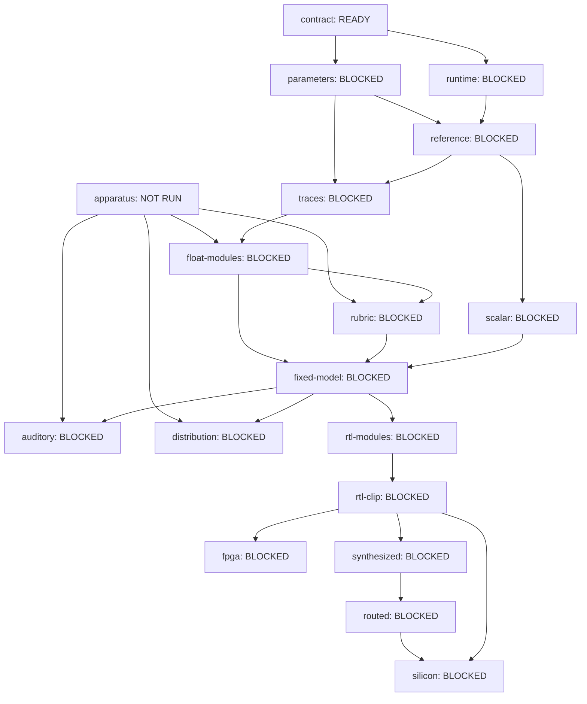

# gf180-torchsynth

A hardware canary for the default
[TorchSynth Voice](https://github.com/torchsynth/torchsynth), targeting the
GlobalFoundries **gf180mcu** open PDK. The first product profile is a sound
explorer: generate a deterministic four-second sound, audition it, repeat it,
save its identity, and explore variations while locking selected parameters.

The target is pinned to TorchSynth commit
`2b0964d4c6c3d472a2a0d54d91b408caaeffca6d`. `Voice` is two audio
oscillators plus noise, six ADSRs, two LFOs, a 4-by-5 modulation matrix, VCAs,
and a mixer. There is no ladder filter in the target graph.

<!-- CAPABILITIES:BEGIN -->
## Evidence-derived capability status

Generated from [canonical node declarations](spec/capabilities-v1.json) and validated evidence. [Full claims, reasons and exclusions](docs/CAPABILITIES.md) · [machine-readable status](docs/capabilities.json) · [case/property scorecard](docs/SCORECARD.md).

| READY | BLOCKED | NOT RUN | PASS | FAIL | NO VERDICT | STALE |
| ---: | ---: | ---: | ---: | ---: | ---: | ---: |
| 1 | 16 | 1 | 0 | 0 | 0 | 0 |

These are claim counts, not a completion percentage or a quality score. READY is unrun, not PASS. BLOCKED retains its local evidence state in the full report. An unattached planned node is allowed by the health check, but establishes no capability. Existing implementations, bounded measurements, closed issues and Loom labels do not stamp PASS; an accepted, current qualification record must cover the exact claim.



Only a node's stated scope is covered by its PASS: implementation identity, auditory/distribution evidence, FPGA, synthesis, routing and silicon are separate claims. The compiler does not run measurements, unseal holdout data, or infer hardware playback.

Regenerate all three views with `python3 tools/compile_capabilities.py`; `--check` checks agreement without writing, and `--strict` additionally rejects unhealthy declared evidence. See [refresh and evidence policy](docs/CAPABILITY-WORKFLOW.md).
<!-- CAPABILITIES:END -->

## Why the first profile is a clip renderer

Stock Voice is whole-clip DSP. Its envelopes know note duration in advance,
its 441 Hz control signals are interpolated across the complete 44.1 kHz
buffer with aligned endpoints, and its mixer may normalize every earlier
sample using a peak found later in the clip. A causal keyboard instrument
would therefore be a new behavior profile, not a transparent API change.

The planned exact-profile hardware boundary keeps nebula sampling and patch
management on the host initially. The core accepts one resolved 78-parameter
patch and a reproducible noise stream, renders the fixed 176,400-sample clip,
and uses deterministic replay for a second normalization/output pass. This
avoids pretending that a four-second future peak is available in real time.

## Repository layout

```text
spec/       target contract, decision records, upstream and corpus manifests
src/        sound identity and pinned TorchSynth reference adapter
tests/      PDK-free contract and identity tests
tools/      contract checker and reference-render entry point
rtl/        reserved for RTL after the fixed-point contract is measured
tb/         reserved for model-to-RTL verification
asic/       reserved for the gf180mcu flow
fpga/       reserved for an optional demonstration target
sim/        append-only evidence records once evidence exists
```

## Quick start

The metadata and contract tests require only Python:

```bash
python3 -m unittest discover -s tests -v
python3 tools/check_contract.py
```

Rendering additionally needs the pinned TorchSynth checkout and its optional
dependencies:

```bash
uv sync --extra reference
uv run gf180-torchsynth inspect 39942
uv run gf180-torchsynth render 39942 \
  --torchsynth-root /path/to/torchsynth \
  --out out/sound-39942
```

Index `39942` is the batch-size-independent identity of the quickstart example
`Voice(...)(312)[0][6]`: `312 * 128 + 6`. The adapter renders with the minimum
reproducible batch size of 32 but produces the same indexed sound.

That batch of 32 is only the canonical Python parameter/noise-selection path.
The hardware core is a one-sound engine: it receives one resolved named patch
and one selected noise stream, then renders one clip. The scalar execution
boundary and small PyTorch batch-shape numeric drift are tracked in
[issue #88](https://github.com/2AMLogic/gf180-torchsynth/issues/88).

The dependency uses a commit-addressed source archive rather than a Git clone.
This is intentional: a normal checkout currently fails when Git LFS requests a
missing documentation image. Runtime Voice files are still verified against
the independent SHA-256 manifest before a render begins.

## Project sequencing

The next gates are deliberately sound-first:

1. Render and audit the preregistered corpus; prove repeat and recall.
2. Build a transparent float decomposition with intermediate traces.
3. Measure fixed-point approximations and ratify widths/error limits.
4. Implement one-shot RTL and compare it exactly with the fixed model.
5. Measure FPGA/gf180 fit before selecting performance controls or shrinking.

See [the roadmap](docs/ROADMAP.md),
[piecewise bring-up and evidence architecture](docs/BRINGUP-AND-EVIDENCE.md),
and [the contract](spec/VOICE-CONTRACT.md).

## Executable backlog

The work is decomposed in Loom as two linked epics with blocked phase trackers
and small leaf issues. Each leaf names its deliverable, acceptance tests,
evidence, non-goals, and machine-readable dependencies:

- [Reference, measurement, and fixed numeric contract](https://github.com/2AMLogic/gf180-torchsynth/issues/1)
- [RTL, feasibility, and sound-explorer instrument](https://github.com/2AMLogic/gf180-torchsynth/issues/2)

The Loom issue DAG schedules work. The [capability DAG](docs/CAPABILITIES.md)
derives claim states from validated evidence, and the generated
[scorecard](docs/SCORECARD.md) reports case/trace/property coverage. The views
are not measurements: explicit unrun claims and sealed holdout remain so.

The immediate parallel frontier is recorded in the first epic. Leaf issues use
`loom:architect` until reviewed/approved; broad phase trackers remain
`loom:blocked` so they cannot be mistaken for builder-sized work.

## License

Apache License 2.0. TorchSynth remains under its own Apache-2.0 license; the
upstream source is referenced and validated, not copied into this repository.
