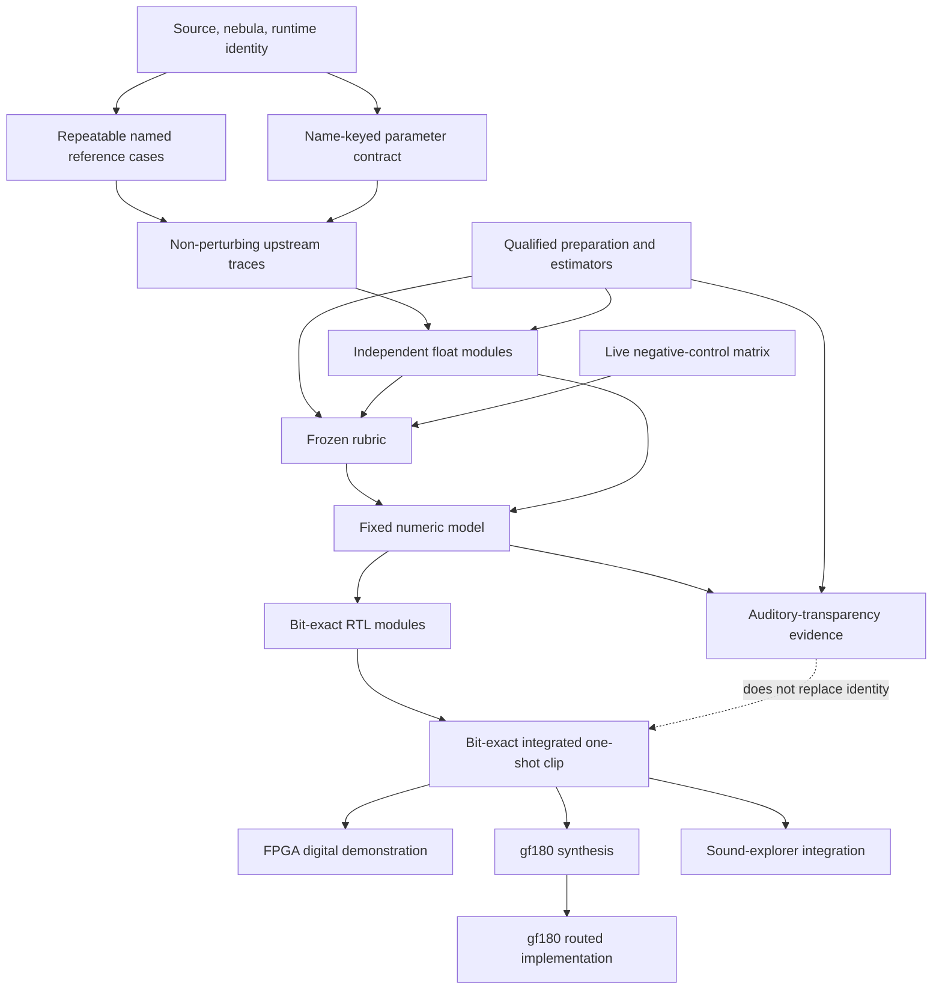

# Piecewise bring-up and evidence architecture

## Outcome

This project will have both a scorecard and a directed capability graph, but
they answer different questions from the Loom issue graph:

| Surface | Question | Source of truth | Planned implementation |
| --- | --- | --- | --- |
| Loom issue DAG | What work is unblocked? | GitHub issue `Depends on` edges | Epics [#1](https://github.com/2AMLogic/gf180-torchsynth/issues/1) and [#2](https://github.com/2AMLogic/gf180-torchsynth/issues/2) |
| Capability DAG | What has actually been demonstrated, and what evidence has gone stale? | Machine-readable nodes plus evidence records | [#85](https://github.com/2AMLogic/gf180-torchsynth/issues/85) |
| Scorecard | Which cases, traces, and properties pass, fail, lack a verdict, have not run, or are stale? | Case registry plus one result per case | [#87](https://github.com/2AMLogic/gf180-torchsynth/issues/87) |

Closing an issue will never make a capability green. Likewise, one green final
waveform will not make every internal module green. Status must be derived from
current evidence, not copied into prose.

## Proposed capability graph

Issue #85 will freeze the node IDs and schema. The dependency shape is already
clear enough to prevent accidental big-bang integration:

The graph separates implementation identity, auditory transparency,
distribution preservation, FPGA operation, synthesis, routing, and eventual
silicon. None is allowed to stand in for another.

## Why TorchSynth supports narrow debugging

TorchSynth was already designed as explicit `SynthModule` blocks at parameter,
control, and audio rates. `Voice.output()` is a readable wiring diagram rather
than an opaque learned model. The upstream reproducibility test goes further:
`compare_voices()` evaluates two Voice instances manually in graph order and
compares most intermediate outputs.

That gives us stable seams for a hardware port:

| Order | Seam | What to prove before moving on |
| ---: | --- | --- |
| 0 | source/config, global identity, named normalized and physical parameters, noise slot | hashes and parameter names agree; fresh-process and supported-batch invariants hold |
| 1 | keyboard pitch and note-on duration | range/mapping truth and exact upstream trace |
| 2 | four LFO ADSRs and two main ADSRs | directed stage timing and amplitude fixtures; exact upstream trace |
| 3 | two raw LFOs, then control-rate VCA outputs | analytic rate/phase/depth plus exact upstream trace |
| 4 | five modulation-matrix outputs | one-route-at-a-time gains and signs plus exact upstream trace |
| 5 | five endpoint-aligned control upsamplers | impulse/ramp truth, endpoint policy, and exact upstream trace |
| 6 | sine VCO, square/saw VCO, and seeded noise before VCA | isolated source properties and exact upstream trace |
| 7 | three post-VCA audio paths | directed gain fixtures and exact upstream trace |
| 8 | pre-normalization mix, full-clip peak/gain, final clip | threshold/tie fixtures, replay decision, and exact upstream trace |

The two main ADSRs are a deliberate improvement over the upstream test: it
computes `adsr_1` and `adsr_2` but only observes them through the modulation
matrix. We will compare them directly so a matrix error cannot hide an envelope
error or vice versa.

## Debugging protocol for each seam

Each module or seam advances through the same small loop:

1. Prove the upstream reference is identified and repeatable for the case.
2. Run a start-red control and observe the expected failure reason.
3. Capture the upstream seam without changing final audio.
4. Exercise the seam with a directed fixture whose truth is analytic where
   possible, not merely self-consistent with a second copy of TorchSynth.
5. Match an independent float implementation to the upstream trace.
6. Choose fixed arithmetic from development sweeps and record the choice,
   rejected alternatives, evidence IDs, and change trigger as data.
7. Match RTL bit-for-bit to the fixed model at that seam.
8. Keep the test and its negative control live after integration.

A seam is not accepted because code exists. Its evidence must name the runnable
check, covered inputs and hashes, implementation engine, negative controls, and
limitations. Changing a covered source, numeric choice, preparation step, or
judge makes the node stale until it is rerun.

## What upstream debug facilities do and do not prove

Useful upstream mechanisms:

- `TORCHSYNTH_DEBUG` enables shape/range assertions in selected modules. For the
  pinned Voice source, notable checks include positive one-dimensional ADSR
  note durations and VCO frequency staying between zero and Nyquist.
- `tests/test_reproducibility.py::compare_voices` supplies the graph-order seam
  map and exercises same-seed determinism.
- The batch-size test compares the same first 256 sounds at batch sizes 32, 64,
  128, and 256.
- The modular-design documentation explicitly treats individual module calls
  and manual wiring as supported use.

Their limits matter:

- comparing two copies of the same code proves reproducibility, not correctness;
- the debug assertions cover only selected preconditions, not DSP fidelity;
- the upstream test does not attach complete artifact/runtime provenance;
- CPU/GPU closeness in the documentation is not an exact cross-device contract;
- TorchSynth's profiler measures performance, not semantic correctness.

Canonical fixtures therefore remain CPU/float32 in a pinned runtime. Supported
reproducible batch sizes are multiples of 32. Batch size 1 is not a valid probe
for this profile, even though it would be a tempting generic invariant.

## Scorecard contract

The initial registry contains the preregistered default-nebula indices 0–127,
split into 96 development and 32 holdout cases. Directed module and boundary
fixtures form a separately versioned family; analytic estimator fixtures are
not misrepresented as Voice sounds.

Every result names its engine, such as pinned upstream float, independent
float, fixed model, integrated RTL, FPGA digital capture, or board audio. The
board must show `PASS`, `FAIL`, `NO VERDICT`, `NOT RUN`, and `STALE` separately.
It reports coverage independently from agreement and never turns missing or
invalid evidence into zero error.

Results stay per property and unit. Sample error, cents, decibels, and envelope
timing are not averaged into a quality number. A release decision is a
conjunction of mandatory rows under one frozen rubric. Smooth objectives may
help choose numeric formats, but the fitted objective cannot be the only judge
of the candidate it optimized.

The board itself is not evidence. Its input records, provenance, current
covered hashes, and live controls are evidence. Until #87 lands, the repository
must continue to say that no scorecard result exists.

## Apparatus is its own failure surface

Parasynth's most transferable lesson is that a correct estimator can still be
fed a biased window, asymmetric filtering, a wrong time origin, or an
inappropriate resample. [Issue #86](https://github.com/2AMLogic/gf180-torchsynth/issues/86)
therefore qualifies signal preparation separately.

Preparation rules are property-specific. Exact paired rows prohibit automatic
alignment, trimming, resampling, and level normalization. Onset-relative and
ratio diagnostics receive only mathematically applicable invariance tests,
such as common shifts, declared silence padding, or common gain. A failed
apparatus invariant yields `NO VERDICT`; it does not implicate the synth and it
does not become a pass.

## Rules that preserve forward progress

- One leaf issue owns one independently verifiable deliverable.
- A cheap question that can refute a premise gates every costly simulation,
  RTL integration, FPGA build, or physical run.
- Named traces localize the first divergence; later cancellations cannot erase
  an earlier red seam.
- Tests and controls are retained after a node passes. Mutation detection is
  rerun, not remembered from the day it was added.
- Holdout data stays sealed until the rubric and fixed model are frozen.
- Failed alternatives and `NO VERDICT` rows remain visible, so improvement does
  not require rewriting history.
- Numeric choices carry status and evidence as machine-readable data; comments
  near literals are not the decision system.

These rules let independent branches proceed in parallel while keeping the
first divergent seam and the exact invalidated claim obvious.

## Primary upstream references

- [TorchSynth modular principles](https://torchsynth.readthedocs.io/en/latest/modular-design/modular-principles.html)
- [Building synths from modules](https://torchsynth.readthedocs.io/en/latest/modular-design/new-synths.html)
- [TorchSynth reproducibility contract](https://torchsynth.readthedocs.io/en/latest/reproducibility/reproducibility.html)
- [Pinned Voice implementation](https://github.com/torchsynth/torchsynth/blob/2b0964d4c6c3d472a2a0d54d91b408caaeffca6d/torchsynth/synth.py)
- [Pinned upstream reproducibility tests](https://github.com/torchsynth/torchsynth/blob/2b0964d4c6c3d472a2a0d54d91b408caaeffca6d/tests/test_reproducibility.py)
- [Parasynth capability DAG](https://github.com/2AMLogic/gf180-parasynth/blob/main/docs/capability-dag.md)
- [Parasynth scorecard rules](https://github.com/2AMLogic/gf180-parasynth/blob/main/docs/scorecard/README.md)

