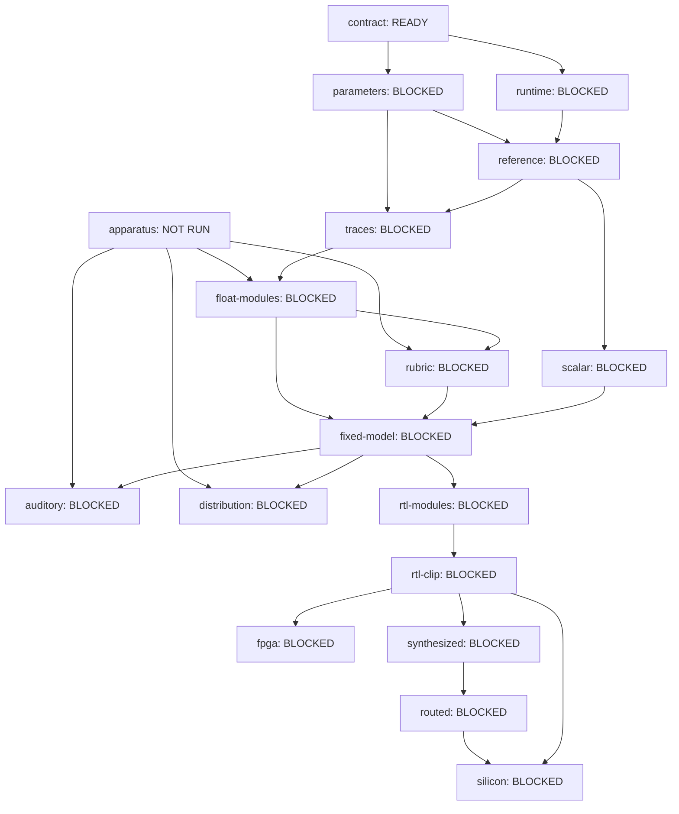

# Capability evidence

<!-- Generated by tools/compile_capabilities.py; edit spec/capabilities-v1.json, never this view. -->

The canonical graph states demonstrated capabilities; the Loom issue DAG schedules work. Issue closure, code existence and a successful downstream node never establish a prerequisite.

The hardware product is one four-second, 44.1 kHz, default-nebula sound per trigger. Canonical batching is a qualification fixture protocol. Resolved scalar execution may use batch_size=1/reproducible=False; scalar/batched equality needs its own measurement. The normative TorchSynth commit remains `2b0964d4c6c3d472a2a0d54d91b408caaeffca6d`.

Run `python3 tools/compile_capabilities.py` to regenerate this document, the root README block and `docs/capabilities.json`; `--check` checks all three views for agreement; `--strict` additionally fails on unhealthy declared evidence (including blocked attempted claims). Planned nodes without evidence are allowed, explicitly unrun, and never counted as passes. Neither mode executes checks or evidence commands. No Torch installation is required.

Evidence follows `spec/schemas/capability-evidence-v1.schema.json`. PASS requires a registered check with matching class/engine/layer/scope, recorded execution and log, provenance with the pinned upstream commit and a covered runtime lock, the current node digest, every covered input digest, exact prerequisite evidence digests, and every named negative control executed and detecting the declared fault. Unknown future checks cannot pass. Synthetic tests establish compiler behavior only; legacy smoke records are not qualified evidence.

Coverage hashes current stored bytes, including dirty and untracked covered files. Directory coverage hashes a sorted relative-file/digest map, without ignoring files. Symlinks and path escapes are refused. Compiler, validators, their schemas and the pinned profile/manifest are implicit covered inputs; registered checks add their implementation and required fixture files. The capability-compiler-v1 check runs only synthetic CapabilityTests; canonical graph/view agreement is checked separately by the normal repository suite and compiler --check/--strict modes. Keeping graph/view bytes outside that check avoids circular evidence/view hashes. The node digest covers its declaration except the evidence pointer, so changing an unrelated node does not invalidate its siblings. Evidence and log digests cover exact stored bytes.

All reference paths, including artifact payload locators, are relative to the supplied repository root. The explicit adapter matches scorecard `artifact.identity` to render `artifact_id` and checks the scorecard digest against exact stored render metadata bytes, never reserialized JSON or a render content ID. Metadata, payload sizes/hashes and runtime lock must resolve; scorecard representation validation alone is not a measurement. Their existing schemas are unchanged.

These are integrity-checked producer attestations, not cryptographic authentication or an independent rerun. A producer that fabricates matching records and logs is outside this trust boundary. New real qualification checks require reviewed registration and scope-specific measurement validation. No current hardware, fidelity, distribution or auditory claim is inferred from the compiler's synthetic fixtures.

Status precedence: evidence is inspected independently, then any prerequisite other than PASS makes the effective state BLOCKED (the local state and reason remain visible). Locally: absent evidence is READY for a registered check or NOT RUN for a planned check; a missing declared record is NOT RUN and unhealthy. Invalid records/references are NO VERDICT; digest changes are STALE. Coverage and references are checked before execution/control outcomes. Explicit nonexecution is NOT RUN; an undetected control or failed check is FAIL; refused measurements are NO VERDICT; only the remaining valid case is PASS. An expensive node is cancellable whenever its named cheaper predecessor is not PASS.

| Node | Claim class | State | Local evidence | Reason |
| --- | --- | --- | --- | --- |
| apparatus | measurement-apparatus | NOT RUN | NOT RUN | planned check is not registered; no evidence attached |
| contract | source-contract | READY | READY | registered check available; no evidence attached |
| parameters | parameter-identity | BLOCKED | NOT RUN | planned check is not registered; no evidence attached; prerequisites not demonstrated: contract=READY |
| runtime | runtime-identity | BLOCKED | NOT RUN | planned check is not registered; no evidence attached; prerequisites not demonstrated: contract=READY |
| reference | reference-repeatability | BLOCKED | NOT RUN | planned check is not registered; no evidence attached; prerequisites not demonstrated: parameters=BLOCKED, runtime=BLOCKED |
| traces | trace-identity | BLOCKED | NOT RUN | planned check is not registered; no evidence attached; prerequisites not demonstrated: parameters=BLOCKED, reference=BLOCKED |
| float-modules | implementation-fidelity | BLOCKED | NOT RUN | planned check is not registered; no evidence attached; prerequisites not demonstrated: apparatus=NOT RUN, traces=BLOCKED |
| rubric | measurement-rubric | BLOCKED | NOT RUN | planned check is not registered; no evidence attached; prerequisites not demonstrated: apparatus=NOT RUN, float-modules=BLOCKED |
| scalar | scalar-execution | BLOCKED | NOT RUN | planned check is not registered; no evidence attached; prerequisites not demonstrated: reference=BLOCKED |
| fixed-model | numeric-fidelity | BLOCKED | NOT RUN | planned check is not registered; no evidence attached; prerequisites not demonstrated: float-modules=BLOCKED, rubric=BLOCKED, scalar=BLOCKED |
| auditory | auditory-transparency | BLOCKED | NOT RUN | planned check is not registered; no evidence attached; prerequisites not demonstrated: apparatus=NOT RUN, fixed-model=BLOCKED |
| distribution | distribution-preservation | BLOCKED | NOT RUN | planned check is not registered; no evidence attached; prerequisites not demonstrated: apparatus=NOT RUN, fixed-model=BLOCKED |
| rtl-modules | implementation-identity | BLOCKED | READY | registered check available; no evidence attached; prerequisites not demonstrated: fixed-model=BLOCKED |
| rtl-clip | implementation-identity | BLOCKED | NOT RUN | planned check is not registered; no evidence attached; prerequisites not demonstrated: rtl-modules=BLOCKED |
| fpga | fpga-operation | BLOCKED | NOT RUN | planned check is not registered; no evidence attached; prerequisites not demonstrated: rtl-clip=BLOCKED |
| synthesized | gf180-synthesis | BLOCKED | NOT RUN | planned check is not registered; no evidence attached; prerequisites not demonstrated: rtl-clip=BLOCKED |
| routed | gf180-routing | BLOCKED | NOT RUN | planned check is not registered; no evidence attached; prerequisites not demonstrated: synthesized=BLOCKED |
| silicon | silicon-operation | BLOCKED | NOT RUN | planned check is not registered; no evidence attached; prerequisites not demonstrated: routed=BLOCKED, rtl-clip=BLOCKED |

## apparatus

Qualified signal preparation and estimators

- Engine/layer/scope: `measurement` / `verification` / `property-specific-preparation`.
- Check: `apparatus-qualification-v1`; planned, no registered runnable implementation.
- Dependencies: none.
- Inputs (plus implicit coverage): `docs/MEASUREMENT-PLAN.md`, `spec/decision-records/0004-verification-claims.md`.
- References: none declared.
- Evidence: none.
- Required controls: asymmetric-filter detects invariance-failure, invalid-window detects invalid-preparation.
- Cheaper cancellation gate: not an expensive node.
- Excludes: Synth correctness; Fidelity verdict for invalid measurements; Automatic alignment for exact paired rows.

## contract

Pinned manifest consistency and missing/changed-file rejection

- Engine/layer/scope: `stdlib` / `reference-contract` / `manifest-consistency`.
- Check: `contract-tests-v1`; `python3 -m unittest discover -s tests -p test_contract.py -v`.
- Dependencies: none.
- Inputs (plus implicit coverage): `spec/VOICE-CONTRACT.md`, `spec/reference/upstream.json`.
- References: none declared.
- Evidence: none.
- Required controls: missing-and-changed-files detects hash-mismatch.
- Cheaper cancellation gate: not an expensive node.
- Excludes: Executing the pinned upstream source; Runtime qualification; DSP correctness; Hardware.

## parameters

Name-keyed normalized and physical parameter contract

- Engine/layer/scope: `stdlib` / `reference` / `named-parameters`.
- Check: `parameter-qualification-v1`; planned, no registered runnable implementation.
- Dependencies: contract.
- Inputs (plus implicit coverage): `spec/reference/parameter-inventory-v1.json`, `src/torchsynth_voice/inventory.py`.
- References: none declared.
- Evidence: none.
- Required controls: renamed-parameter detects name-mismatch.
- Cheaper cancellation gate: not an expensive node.
- Excludes: Sound fidelity; Runtime qualification; Parameter array ordering as identity.

## runtime

Source, default nebula and CPU float32 runtime qualification

- Engine/layer/scope: `pinned-upstream` / `reference` / `cpu-float32`.
- Check: `runtime-qualification-v1`; planned, no registered runnable implementation.
- Dependencies: contract.
- Inputs (plus implicit coverage): `spec/VOICE-CONTRACT.md`, `spec/reference/upstream.json`, `env/release-era/requirements.lock`, `env/release-era/probe.py`, `env/release-era/test_probe.py`.
- References: none declared.
- Evidence: none.
- Required controls: changed-runtime detects runtime-mismatch, changed-source detects hash-mismatch.
- Cheaper cancellation gate: not an expensive node.
- Excludes: Cross-runtime byte identity; Scalar/batched equality; Hardware.

## reference

Repeatable named canonical batched reference cases

- Engine/layer/scope: `pinned-upstream` / `reference` / `canonical-batch-fixtures`.
- Check: `reference-repeatability-v1`; planned, no registered runnable implementation.
- Dependencies: runtime, parameters.
- Inputs (plus implicit coverage): `src/torchsynth_voice/render.py`, `spec/reference/corpus-v0.json`.
- References: none declared.
- Evidence: none.
- Required controls: changed-noise-slot detects noise-mismatch, fresh-process-drift detects repeatability-mismatch.
- Cheaper cancellation gate: parameters.
- Excludes: Hardware batching; DSP correctness from self-comparison; Distribution preservation.

## traces

Non-perturbing named upstream seam captures

- Engine/layer/scope: `pinned-upstream` / `reference` / `named-seams`.
- Check: `trace-qualification-v1`; planned, no registered runnable implementation.
- Dependencies: reference, parameters.
- Inputs (plus implicit coverage): `src/torchsynth_voice/render.py`, `spec/reference/corpus-v0.json`.
- References: none declared.
- Evidence: none.
- Required controls: omitted-seam detects trace-missing, perturbed-capture detects final-audio-mismatch.
- Cheaper cancellation gate: parameters.
- Excludes: Independent implementation correctness; Auditory transparency.

## float-modules

Independent floating modules match qualified upstream seams

- Engine/layer/scope: `independent-float` / `model` / `seam-metrics`.
- Check: `float-module-qualification-v1`; planned, no registered runnable implementation.
- Dependencies: traces, apparatus.
- Inputs (plus implicit coverage): `docs/MEASUREMENT-PLAN.md`, `spec/decision-records/0004-verification-claims.md`.
- References: none declared.
- Evidence: none.
- Required controls: wrong-route-sign detects seam-mismatch.
- Cheaper cancellation gate: apparatus.
- Excludes: Fixed-point sample identity; Auditory transparency; Distribution preservation.

## rubric

Frozen property rubric with live negative-control matrix

- Engine/layer/scope: `measurement` / `verification` / `frozen-rubric`.
- Check: `rubric-qualification-v1`; planned, no registered runnable implementation.
- Dependencies: float-modules, apparatus.
- Inputs (plus implicit coverage): `docs/MEASUREMENT-PLAN.md`, `spec/decision-records/0004-verification-claims.md`.
- References: none declared.
- Evidence: none.
- Required controls: undetected-mutation detects control-failure.
- Cheaper cancellation gate: not an expensive node.
- Excludes: Averaging unlike units into a quality score; Holdout tuning; Hardware.

## scalar

Resolved one-sound execution and measured scalar/batched divergence

- Engine/layer/scope: `pinned-upstream` / `reference` / `resolved-scalar`.
- Check: `scalar-qualification-v1`; planned, no registered runnable implementation.
- Dependencies: reference.
- Inputs (plus implicit coverage): `src/torchsynth_voice/render.py`, `spec/reference/corpus-v0.json`, `docs/BRINGUP-AND-EVIDENCE.md`.
- References: none declared.
- Evidence: none.
- Required controls: wrong-noise-stream detects noise-mismatch, wrong-resolved-parameter detects parameter-mismatch.
- Cheaper cancellation gate: reference.
- Excludes: Assumed scalar/batched bit identity; Changing normalization or the default nebula; Hardware qualification.

## fixed-model

Fixed numeric model satisfies declared float-to-fixed metrics

- Engine/layer/scope: `fixed-model` / `model` / `default-one-shot`.
- Check: `fixed-model-qualification-v1`; planned, no registered runnable implementation.
- Dependencies: rubric, float-modules, scalar.
- Inputs (plus implicit coverage): `docs/MEASUREMENT-PLAN.md`, `spec/decision-records/0004-verification-claims.md`.
- References: none declared.
- Evidence: none.
- Required controls: numeric-mutation detects metric-failure.
- Cheaper cancellation gate: rubric.
- Excludes: RTL identity; Auditory transparency; Distribution preservation.

## auditory

Auditory transparency under a separately frozen listening protocol

- Engine/layer/scope: `listening-study` / `perception` / `preregistered-listening`.
- Check: `auditory-qualification-v1`; planned, no registered runnable implementation.
- Dependencies: fixed-model, apparatus.
- Inputs (plus implicit coverage): `docs/MEASUREMENT-PLAN.md`, `spec/decision-records/0004-verification-claims.md`.
- References: none declared.
- Evidence: none.
- Required controls: audible-anchor detects anchor-not-detected.
- Cheaper cancellation gate: apparatus.
- Excludes: Sample identity; Distribution preservation; FPGA or silicon operation.

## distribution

Distribution preservation over a declared corpus and statistical protocol

- Engine/layer/scope: `statistical-study` / `distribution` / `preregistered-corpus`.
- Check: `distribution-qualification-v1`; planned, no registered runnable implementation.
- Dependencies: fixed-model, apparatus.
- Inputs (plus implicit coverage): `docs/MEASUREMENT-PLAN.md`, `spec/decision-records/0004-verification-claims.md`, `spec/reference/corpus-v0.json`.
- References: none declared.
- Evidence: none.
- Required controls: biased-corpus detects distribution-shift.
- Cheaper cancellation gate: apparatus.
- Excludes: Auditory transparency; Per-sound identity; Hardware.

## rtl-modules

RTL modules are sample-exact with the fixed model

- Engine/layer/scope: `rtl-simulation` / `rtl` / `module-sample-exact`.
- Check: `rtl-module-qualification-v1`; `python3 -m unittest discover -s tests -p test_rtl_module_qualification.py -v`.
- Dependencies: fixed-model.
- Inputs (plus implicit coverage): `docs/MEASUREMENT-PLAN.md`, `sim/reference/adsr-golden-v1`, `sim/reference/fixed-voice-golden-v1.json`, `sim/reference/golden-vector-fixed-anchor.json`, `sim/reference/lfo-vca-golden-v1`, `sim/reference/mod-matrix-golden-v1`, `spec/RTL-MODULE-QUALIFICATION.md`, `spec/decision-records/0004-verification-claims.md`, `tb/sv`.
- References: none declared.
- Evidence: none.
- Required controls: one-bit-mutation detects sample-mismatch.
- Cheaper cancellation gate: fixed-model.
- Excludes: Physical timing; Sound fidelity beyond fixed model; Line, toggle and branch code coverage (no Icarus instrument; see spec/RTL-MODULE-QUALIFICATION.md); SVA assertion/cover-point coverage (the benches assert procedurally; negative-control coverage is reported instead); Verilator width/sign diagnostics at their committed waived counts (tb/rtl-lint-baseline.json); sim/reference/sine-vco-golden-v1 and sim/reference/square-saw-vco-golden-v1 vector-set hashes (their vector filenames use ':' delimiters that torchsynth_voice.capabilities._relative()'s path-safety pattern refuses; see spec/RTL-MODULE-QUALIFICATION.md).

## rtl-clip

Integrated four-second RTL clip is sample-exact with the fixed model

- Engine/layer/scope: `rtl-simulation` / `rtl` / `default-one-shot`.
- Check: `rtl-clip-qualification-v1`; planned, no registered runnable implementation.
- Dependencies: rtl-modules.
- Inputs (plus implicit coverage): `spec/VOICE-CONTRACT.md`, `spec/reference/upstream.json`.
- References: none declared.
- Evidence: none.
- Required controls: normalization-mutation detects gain-mismatch, sample-slip detects sample-mismatch.
- Cheaper cancellation gate: rtl-modules.
- Excludes: Live notes; Drum nebula; FPGA or silicon execution; Auditory transparency.

## fpga

FPGA digital captures match the integrated one-shot model

- Engine/layer/scope: `fpga-capture` / `hardware` / `digital-one-shot`.
- Check: `fpga-qualification-v1`; planned, no registered runnable implementation.
- Dependencies: rtl-clip.
- Inputs (plus implicit coverage): `spec/VOICE-CONTRACT.md`, `spec/reference/upstream.json`.
- References: none declared.
- Evidence: none.
- Required controls: capture-bit-flip detects sample-mismatch.
- Cheaper cancellation gate: rtl-clip.
- Excludes: Analog audio; gf180 synthesis or routing; Silicon.

## synthesized

gf180mcu synthesis with committed mapped-flow evidence

- Engine/layer/scope: `klt` / `synthesis` / `gf180-default-one-shot`.
- Check: `gf180-synthesis-qualification-v1`; planned, no registered runnable implementation.
- Dependencies: rtl-clip.
- Inputs (plus implicit coverage): `spec/VOICE-CONTRACT.md`, `spec/reference/upstream.json`.
- References: none declared.
- Evidence: none.
- Required controls: wrong-library detects library-mismatch.
- Cheaper cancellation gate: rtl-clip.
- Excludes: Routing; Timing signoff; Hardware playback; Sound fidelity from cell counts.

## routed

gf180mcu routed implementation with declared physical checks

- Engine/layer/scope: `klt` / `physical` / `gf180-default-one-shot`.
- Check: `gf180-routing-qualification-v1`; planned, no registered runnable implementation.
- Dependencies: synthesized.
- Inputs (plus implicit coverage): `spec/VOICE-CONTRACT.md`, `spec/reference/upstream.json`.
- References: none declared.
- Evidence: none.
- Required controls: physical-violation detects physical-check-failure.
- Cheaper cancellation gate: synthesized.
- Excludes: Silicon fabrication; Board audio; Unmeasured signoff corners.

## silicon

Fabricated silicon operates as the declared one-shot digital engine

- Engine/layer/scope: `silicon-capture` / `hardware` / `digital-one-shot`.
- Check: `silicon-qualification-v1`; planned, no registered runnable implementation.
- Dependencies: routed, rtl-clip.
- Inputs (plus implicit coverage): `spec/VOICE-CONTRACT.md`, `spec/reference/upstream.json`.
- References: none declared.
- Evidence: none.
- Required controls: capture-corruption detects sample-mismatch.
- Cheaper cancellation gate: routed.
- Excludes: Analog auditory transparency; Distribution preservation; Unmeasured operating conditions.
